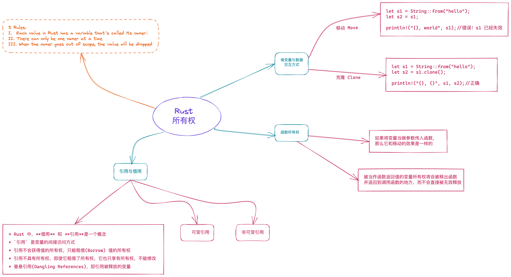

Rust 所有权概念总结
=================

### 所有权：

* 一个值只能被一个变量所拥有，这个变量被称为所有者（Each value in Rust has a variable that’s called its owner）；
* 一个值同一时刻只能有一个所有者（There can only be one owner at a time），也就是说不能有两个变量拥有相同的值。所以对应变量赋值、参数传递、函数返回等行为，旧的所有者会把值的所有权转移给新的所有者，以便保证单一所有者的约束；
* 当所有者离开作用域，其拥有的值被丢弃（When the owner goes out of scope, the value will be dropped），内存得到释放；

### 堆变量与数据的交互模式
#### 移动(Move)
Move 语义：赋值或者传参会导致值 Move，所有权被转移，一旦所有权转移，之前的变量就不能访问。
#### 克隆(Clone)
Copy 语义：如果值实现了 Copy trait，那么赋值或传参会使用 Copy 语义，相应的值会被按位拷贝（浅拷贝），产生新的值。

* 如果不希望值的所有权被转移，在 Move 语义外，Rust 提供了 Copy 语义。
* 如果一个数据结构实现了 Copy trait，那么它就会使用 Copy 语义赋值或者传参时，值会自动按位拷贝（浅拷贝）。

> * 原生类型，包括函数、不可变引用和裸指针实现了 Copy；
> * 数组和元组，如果其内部的数据结构实现了 Copy，那么它们也实现了 Copy；
> * 可变引用没有实现 Copy；
> * 非固定大小的数据结构，没有实现 Copy;

#### 函数所有权机制
* `向函数传递参数的所有权机制`
    如果将变量当做参数传入函数，那么它和移动的效果是一样的
* `函数返回值的所有权机制`
被当作函数返回值的变量所有权将会被移除函数并返回到调用函数的地方，而不会直接被无效释放

### 引用和借用
  * Rust 中，**借用** 和 **引用**是一个概念
  * `引用` 是变量的间接访问方式
  * 引用不会获得值的所有权，只能租借(Borrow) 值的所有权
  * 引用不具有所有权，即使它租借了所有权，它也只享有所有权，不能修改
  * 垂悬引用(Dangling References)，即引用被释放的变量

#### 1.不可变引用(只读引用)：

* Rust 所有的参数传递都是传值
* 可以通过使用不可变引用来借用值的访问权限。
* 不可变引用实现了 Copy trait, 引用的赋值，传参都会产生新的拷贝
* 不可变引用允许多个访问者同时读取一个数据
* 不可变引用的借用不能超过（outlive）值的生命周期(作用域)。

#### 2. 可变引用：

* 使用可变引用来获得借用值的可修改权限。
* 在一个作用域内，仅允许一个活跃的可变引用。如果只是定义了，却没有使用或者当作只读引用使用，不算活跃。
* 活跃的可变引用（写）和只读引用（读）是互斥的，不能同时存在。
* 一个资源的可变引用与不可变引用的作用域不能交叠(overlap)
* 可变引用的生命周期也不能超过它所借用的值的生命周期。
* 可变引用不能被复制，只能移动（move）

## 总结

Rust 的所有权规则，解决了谁真正拥有数据的底层逻辑问题，让堆上数据的多重引用不复存在，这是它最大的优势。通过所有权机制所定义的规则，确保代码的内存安全以及并发安全，通过合理的利用所有权规则，使得保持安全性的同时能够让程序实现得更加高效。

